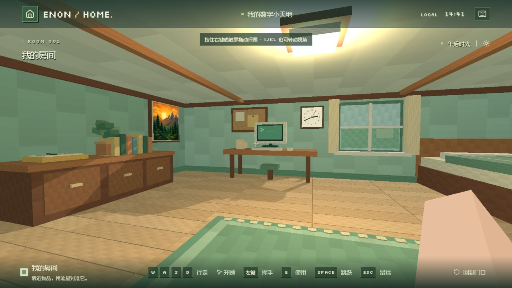
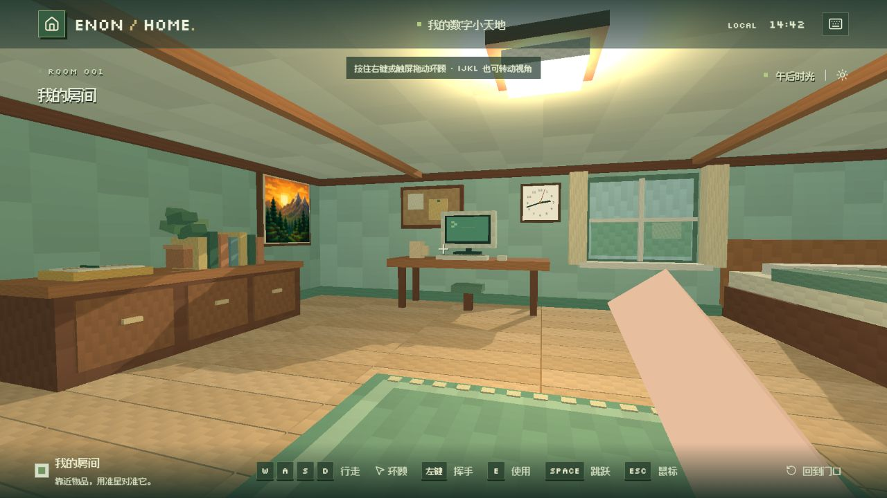
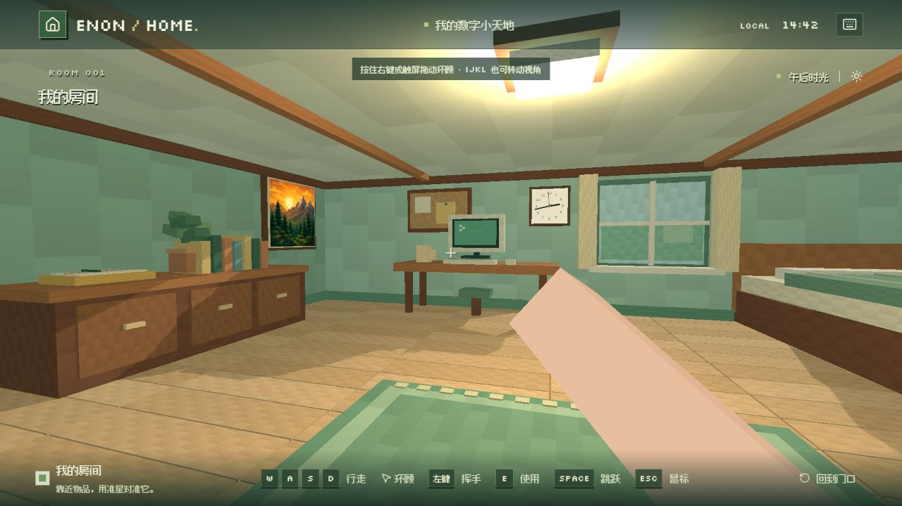

# Enon Home

第一人称的方块风 3D 数字小屋，使用本地像素字体。视点位于房间内部，四面墙和天花板完整围合。根据上一级的 `Enon Home.md` 及第一人称修正要求实现。

当前版本：**0.4.0**（Phase 1 — Persistent Workstation；实现与已完成的检查见下，Git 提交由作者执行）。

## 0.4.0 更新 · Persistent Workstation

电脑窗口现在是 **WORKSTATION / 工作台**，内部当前只有 **TERMINAL**。第一次使用电脑才创建 xterm、WebSocket 和真实 PowerShell PTY；之后关闭窗口、返回房间或使用其他应用，只隐藏工作台。同一页面内重新打开时继续使用原来的终端、scrollback、目录、变量和进程，运行中的任务也继续输出。

### 修改文件与职责

| 文件 | 修改原因 |
| --- | --- |
| `components/apps/workstation.tsx` | 新增电脑内部功能边界，当前仅承载 Terminal；保留工具类型，不创建未来功能的空页面 |
| `app/page.tsx` | 增加首次启动后不再重置的 `workstationStarted`；持久挂载 Workstation，按 `active` 隐藏并设置 `aria-hidden` / `inert`；更新窗口标题 |
| `components/ui/dialog.tsx` | 将可选 `keepMounted` 传给 Base UI Portal，默认仍为 `false`，仅工作台所在弹窗按需启用 |
| `components/apps/terminal.tsx` | 分离连接与可见性生命周期；隐藏时取消待执行的尺寸调整和聚焦，显示后下一帧重新 fit、发送尺寸并聚焦 |
| `app/globals.css` | 隐藏非活动工作台，使其不占其他应用的布局空间，并添加 TERMINAL 标题样式 |
| `lib/player/body.ts` | 将一处坐标展开改为三个显式参数，修复已有 TS2556 类型错误，传入数值及手臂行为不变 |
| `tests/movement.test.ts` | 将扩大房间前写死的桌前坐标改为当前家具边界，继续验证大步长移动不能穿过桌子 |
| `package.json` / `package-lock.json` | 同步版本号至 `0.4.0`，未升级依赖 |
| `README.md` / `docs/workstation-v0.4.0/` | 记录生命周期、验收结果、限制与浏览器截图 |

### 生命周期

- 页面加载：`workstationStarted=false`，尚无 xterm / WebSocket / PTY。
- 第一次使用电脑：`workstationStarted=true`，挂载 `WorkstationApp` 与 `TerminalApp`，创建连接和 PowerShell。
- 关闭窗口或打开其他应用：`active=false` 仅代表 Terminal 不可见；组件、连接、PTY 和已有输出保持存在，后台消息继续写入同一个 xterm。隐藏时不执行 fit，也不发送 resize。
- 再次打开：显示同一个组件；确认容器尺寸非零后重新 fit、同步 PTY 尺寸并恢复输入焦点。
- 显式点击「重新连接」：增加 `attempt`，清理旧连接和终端，再创建新会话。连接 effect 仍只依赖 `[attempt]`，不依赖 `active`。
- 页面真正卸载或离开网站时，仍清理 ResizeObserver、输入订阅、WebSocket 和 xterm；服务端继续按原有断开清理逻辑结束 PTY。

### 已完成的验证与剩余项

本阶段文档明确要求执行检查，因此本轮按该要求运行；作者随后要求停止测试并直接整理 README，以下保留实际完成状态，不将未完成项目记为通过。

| 检查 | 实际结果 |
| --- | --- |
| 关闭电脑 → 走动 → 重开 | PID 前后均为 `20896`；`$global:EnonRoomSession` 仍输出 `still-alive`；执行 `cd ..` 后的目录仍为 `D:\` |
| 运行十秒任务期间关闭窗口 | `1..10` 全部输出保留，时间戳连续为 `2026-09-09 20:18:15–20:18:24` |
| 隐藏状态 | 终端 DOM 保留，容器宽高为零且 pane 为 `inert`；后端会话数保持 1 |
| Notes 往返 | 本轮新页面的基准 PID 为 `36528`；往返后 PID、`still-alive` 和 `D:\` 均保留 |
| TV 往返 | 电视选择界面正常打开；返回工作台仍为 PID `36528`，变量和目录保留。窗口变窄后终端重新适配尺寸并可继续输入 |
| Cube | 已打开魔方应用并看到模型与操作界面；转动操作及返回工作台后的 PID 核对未完成，按作者要求停止继续测试 |
| Ctrl+C | 独立 PTY 使用与服务相同的 PowerShell 启动参数，收到 `\x03` 后 66 ms 内中断 `Start-Sleep`，后续标记未输出。浏览器工具的 Ctrl+C 没有产生页面键盘事件，故浏览器端快捷键验收未完成；临时诊断文件和测试进程已清理 |
| `npm run typecheck` | 通过；已有坐标参数类型错误已做最小修复 |
| `npm test` | 14 / 14 通过；家具防穿透测试已改用当前布局边界 |
| `npm run build` | 通过；仍有大于 500 kB 的构建产物提示及 vinext 路由静态分类提示 |

浏览器证据：

- [初始 PID、变量与目录](docs/workstation-v0.4.0/session-before.png) / [走动后重开](docs/workstation-v0.4.0/session-reopened.png)
- [窗口关闭期间的十行输出](docs/workstation-v0.4.0/background-output.png)
- [Notes 往返](docs/workstation-v0.4.0/after-notes.png) / [TV 往返](docs/workstation-v0.4.0/after-tv.png)

### 本阶段限制

**浏览器刷新后不会保留 PTY；`npm run dev` 重启后不会保留 PTY。** 本阶段只保持同一页面内工作台组件的生命周期，未实现跨刷新恢复、服务端持久会话管理、输出回放、多终端或 Projects / Git / Codex 集成。`server/terminal.mjs` 未修改，原有 `127.0.0.1` 监听、Origin / Host 校验和随机令牌机制保持原样。

建议 commit 信息（由作者执行提交）：

```text
feat: keep workstation terminal alive when returning to room

- mount Workstation lazily and retain it after the first computer interaction
- separate terminal connection lifetime from dialog visibility
- skip hidden fit/resize and restore terminal focus on reopen
- retain explicit reconnect cleanup and the existing local PTY backend
- fix existing typecheck and furniture-boundary test failures
- document validation limits and bump version to 0.4.0
```

## 0.3.7 更新

- 调整依据改为手臂轮廓的**最上端角点**。之前的 `(91%, 80%)` 和挥动 `y=66%` 是手部中心，前端与截面角点实际上更高；旧版挥动全程最高点达到屏高约 `53.47%`，造成露出的手臂过长。
- 静止手部中心 `y=80% → 83%`，挥动峰值中心 `y=66% → 72%`，让更多前臂留在画面下方。保留 `0.12 × 0.16` 截面、模型长度、肤色和整体 `scale=1`。
- 沿用约 80° 的靠右 idle 与绕屏幕外 pivot 的旋转内扫。新的峰值轴线约 45.69°，中央推进仍由旋转产生；没有改变输入、交互、身体显示或挥动时长。
- `scripts/measure-arm.mjs` 新增前端中心、上端四角经过视口裁切后的最高点，以及整个动作周期的最高点与相位，避免将手部中心误当成上沿，或只检查 `t=0.25`。

### 最上端坐标对照

坐标从画面左上角起算，`x` 为屏宽百分比、`y` 为屏高百分比；**y 越大，手臂上端越靠下，露出长度越短**。参考图人工读点：第 4 张静止上端约 `(77.04%, 70.33%)`，第 3 张细臂挥动上端约 `(55.94%, 59.44%)`，误差约 ±0.2–0.6 个百分点。本轮采用这两张的纵向高度作为参照，静止横向继续保留项目原有的靠右布局。

项目在 **1280×720、垂直 FOV 72°** 下的实际姿态投影：

| 状态 | 0.3.6 最上端 `(x, y)` | 0.3.7 最上端 `(x, y)` |
| --- | --- | --- |
| Idle | 91.73%, 68.03% | 91.75%, 71.21% |
| 起手中段 | 74.92%, 55.77% | 76.96%, 63.15% |
| Swing peak（`t=0.25`） | 62.03%, 54.59% | 65.77%, 61.08% |
| 整个动作周期的最高点 | 66.43%, 53.47% | 67.29%, 60.88% |

最高点并不正好出现在旋转峰值：旧版约在 `t=0.094`，新版约在 `t=0.144`。新版峰值手部中心是 `(67.67%, 72%)`，与上表中的上端角点分开记录。静止可见面积由约 `4.17% → 3.66%`，挥动峰值由约 `5.48% → 4.05%`。

对 4:3、16:10、16:9、21:9 的整个动作周期进行坐标采样，最上端 y 分别不小于约 `60.17% / 60.66% / 60.88% / 61.02%`，基部截面保持在画面外。数据为站立、无行走晃动的几何投影。本轮只完成参考图读点与姿态坐标核对，未运行浏览器测试、项目测试、类型检查、构建或 Git 操作。

建议 commit 信息：

```text
fix: lower arm tip to reduce visible forearm length

- lower idle and swing targets using the uppermost tip instead of the hand centre
- retain slim thickness and the fixed-pivot rotational sweep
- report tip coordinates and the highest point across the full swing
- document reference comparison and bump version to 0.3.7
```

## 0.3.6 更新

- 第一人称手臂截面从 `0.15 × 0.20` 调为 `0.12 × 0.16`，宽、深均减少 20%，保留 Alex 风格的 `3:4` 比例。长度、整体 `scale=1`、肤色和连续表面保持原样。
- 保留约 80° 的靠右 idle、屏幕外肘侧 pivot、非线性旋转内扫及约 45.6° 的挥动峰值；手部中心轨迹、挥动时长和交互逻辑未改变。
- 第一人称粗细使用 `view.thickness`；低头身体的双臂使用 `body.thickness`，仍为 `0.15 × 0.20`。两者独立调节，收细画面中的手臂不会改变身体比例。
- 投影测量新增几何可见面积占屏比例，以及垂直于长轴、位于可见长度中点的横截宽度。不会把斜向手臂的整个水平包围盒误认为手臂粗细。

### 参考图与占屏比例

本次五张 Minecraft 参考图包含不同皮肤、姿态和画面比例，不能视为同一条动画的连续帧。其中第 4 张是静止参考，第 3 张提供较细的挥动比例，第 5 张是另一种挥动姿态。对其手工轮廓取点的估计如下，**并非精确分割或 Minecraft 的固定渲染规格**：

| 参考图（按本次提供顺序编号） | 中部横截宽 / 屏高 | 手臂轮廓面积 / 屏幕 |
| --- | --- | --- |
| 第 3 张：较细手臂挥动 | 约 16.8%–17.0% | 约 4.35% |
| 第 4 张：近竖直静止 | 约 29.4%–29.8% | 约 4.47% |
| 第 5 张：另一皮肤挥动 | 约 23.5%–24.0% | 约 5.68% |

手工估计误差约为：宽度 ±1 个屏高百分点，面积 ±0.3–0.5 个屏幕百分点；包含对 HUD 后方轮廓的推断。上一版的 idle 与第 4 张其实相近；此次采用第 3 张更细的挥动截面，并兼顾静止占屏面积，不把所有参考图都解释为“越细越好”。

下表为项目实际姿态代码在 **1280×720、垂直 FOV 72°** 下的投影计算；面积已按视口边缘裁切，但不扣除底部 HUD 覆盖的部分。横截宽按屏高归一化，避免宽高比和挥动斜角混淆粗细。

| 状态 | 0.3.5 横截宽 / 屏高 | 0.3.6 横截宽 / 屏高 | 0.3.5 占屏面积 | 0.3.6 占屏面积 |
| --- | --- | --- | --- | --- |
| Idle | 31.18% | 25.69% | 5.20% | 4.17% |
| 起手中段 | 21.73% | 17.29% | 5.85% | 4.59% |
| Swing peak | 22.15% | 17.55% | 6.92% | 5.48% |

新的挥动横截宽接近第 3 张，静止面积接近第 4 张；可见长度和具体动作帧不同，面积不要求与单张参考完全相等。本轮只做参考图比例分析与投影数值核对，未运行浏览器测试、项目测试、类型检查、构建或 Git 操作。

建议 commit 信息：

```text
fix: slim first-person arm to match reference proportions

- reduce view-arm width and depth by 20 percent while preserving length and motion
- separate view and body arm thickness settings
- measure projected screen coverage and perpendicular arm width
- document reference comparison and bump version to 0.3.6
```

## 0.3.5 更新

- 取消 45° idle，改为右侧近竖直姿态：投影轴线约 `80°`，手部中心位于 `(91%, 80%)`，手端在右侧约 86%–94% 区域进入画面，pivot 留在底边外 `y=120%`。Alex 暖肤色、`0.15 × 0.20` slim 截面与 `scale=1` 保持不变。
- 修复额外“第三个面”的实际来源：原先手与前臂是两个重叠盒子，关闭深度测试时内部接面会透出。现在使用一根同样外部尺寸的连续几何，去掉内部接面；没有缩小模型或改变材质。
- 分别从 idle 和峰值的屏幕目标射线求出真实臂轴，以两条臂轴的叉积作为固定旋转轴。挥动绕屏幕外肘侧 pivot 画圆弧，由近竖直转为斜向中央；不再用手部位置插值或固定的一组 Euler 数值凑终点。
- 峰值目标为中右区域：根据窗口宽高比选择 `x=60%–72%`，`y=66%`，对角线约 `45°`。同时约束两条射线可达，保持根部位置稳定。
- 主旋转由 `sin(π√t)` 驱动；小幅轴向转动使用 `sin(πt²)`，上下轻微起伏使用 `sin(2π√t)`，深度位移使用 `sin(πt)`。中央平移仅 `-0.006`，单次动作仍为 `0.32` 秒。
- 保持 idle、walk bob、swing 分层，控制、左键连续挥动、物品交互、跳跃及身体显示开关的逻辑未改动。

建议 commit 信息：

```text
fix: restore upright arm idle and arc-based inward swing

- place the full-size Alex slim arm near the right screen edge
- rotate from upright idle into a diagonal swing around the off-screen elbow
- remove visible internal caps with a continuous view-arm mesh
- document three-frame comparison and bump version to 0.3.5
```

### 0.3.5 历史三帧对照（0.3.6 收细前）

以下是同一房间、同一视角下的浏览器截图（1280×720），不是示意图。仅在截图时临时固定动作相位，定格代码已移除。

| A · Idle | B · 起手中段 | C · Swing peak |
| --- | --- | --- |
|  |  |  |

16:9、垂直 FOV 72° 的姿态投影数据如下。这里的角度是屏幕平面的轴线锐角；同时观察可见边缘，避免只量中心线导致观感判断失真。

| 状态 | 屏幕轴线角度 | 手部中心 x / y |
| --- | --- | --- |
| Idle | 80.00° | 91.00% / 80.00% |
| 起手中段（扫角 50%） | 57.50° | 75.93% / 67.18% |
| Swing peak | 45.61° | 64.59% / 66.00% |

Idle 主面的两条纵边实际约 `73.85° / 83.12°`，可见主面和侧面面积约 `80% / 20%`。峰值绕肘旋转约 `71.26°`，与 idle 的朝向有明显差异。以 1600×900 计算，手部位移中旋转贡献约 `434px`，辅助平移约 `7px`。测量改为统计整根连续表面，而非只统计手部小盒子。

由于使用 `sin(π√t)`，扫角峰值在 `t=0.25`；B 帧是扫角走到一半时的 `t=1/36`，`t=0.5` 已进入回程，轴线约 `50.53°`。三帧按起手顺序排列，不将回程误标为前挥中段。

4:3、16:10、16:9、21:9 数值采样的 idle 均为 80°，峰值分别约 48.75°、45.58°、45.61°、45.74°。全程基部截面均在画面外，前端截面背向镜头。本轮仅完成要求的手臂截图与姿态数值对照，未代运行项目测试、类型检查、构建或 Git 操作；实际点击手感仍由作者验收。

作者可复算渲染共用的姿态代码：

```powershell
node --experimental-strip-types scripts/measure-arm.mjs
```

## 0.3.4 更新

- 按真实相机投影求解 idle：手部中心固定在屏幕 `(77%, 70%)`，长轴与屏幕水平线的锐角为 `45°`。计算包含宽高比，不直接把 Three.js 的 roll 设置成 45°。
- 用手部目标射线、屏幕外 pivot 射线和模型实际长度求出三维倾角；手端朝前伸、顶面背向镜头。Alex 暖肤色、slim 截面与正常缩放继续保留。
- 摆动改为相机坐标系中的 `swing rotation × idle rotation`，围绕肘侧 pivot 内扫。默认内扫 yaw `55°`、roll `20°`、pitch `15°`，窄窗口使用较小 yaw 与适配 pitch。
- 默认中央平移从 `0.34` 降为 `0.015`；旋转是主动作，平移仅作辅助。少量前臂轴向转动让正面、侧面的可见比例随动作改变。
- 使用 `sin(π√t)` 驱动内扫，roll 使用其 `1.35` 次幂，深度位移使用 `sin(πt)`；没有 idle/peak 的线性插值往返。
- 保留 `idle → walk bob → armPivot → armMesh` 分层。只向屏幕外延长肘侧连接段，未缩小模型，也不再逐帧大幅移动 pivot 以隐藏基部。
- 姿态计算集中在 `lib/player/arm-motion.ts`；渲染和数值测量共用同一份计算，控制与交互逻辑未改动。

建议 commit 信息：

```text
fix: solve 45-degree arm projection and add pivot-driven swing

- solve idle pose from camera rays and the real slim arm length
- replace large translation with nonlinear yaw and roll around the elbow
- retain small secondary translation and visible face changes
- share pose math with projection measurements and document version 0.3.4
```

### 0.3.4 历史投影数值（idle 目标已在 0.3.5 替换）

按本轮明确要求计算投影，没有运行项目测试、构建或浏览器验收。相机垂直 FOV 为 72°，坐标百分比从屏幕左上角起算。峰值指内扫旋转最大时（`t=0.25`）。

| 视口 | Idle 锐角 | Idle 手部中心 | Swing 峰值手部中心 |
| --- | --- | --- | --- |
| 1280×960（4:3） | 45.000° | 77.00%, 70.00% | 55.92%, 63.68% |
| 1440×900（16:10） | 45.000° | 77.00%, 70.00% | 57.03%, 64.73% |
| 1600×900（16:9） | 45.000° | 77.00%, 70.00% | 57.51%, 65.48% |
| 2100×900（21:9） | 45.000° | 77.00%, 70.00% | 61.67%, 59.83% |

从右下指向左上的**有向角是 135°，对应水平线锐角 45°**。1600×900 下，纯旋转造成约 `294.21px` 的手部位移，辅助平移额外造成约 `23.12px`；起手路径偏离直线弦约 `24.51px`。手部正/侧面中侧面的投影面积占比由约 `31.35%` 变为 `57.23%`。

每个视口采样整个动作的 1001 个相位：基部截面经视口裁剪后的可见面积均为 `0px²`，手顶面均背向相机。以上是几何计算结果，材质与实际动画观感仍由作者在网页中验收。

作者可复算同一份渲染姿态代码：

```powershell
node --experimental-strip-types scripts/measure-arm.mjs
```

## 0.3.3 更新

- 保留 Alex 风格暖肤色、`3:4` slim 截面、现有模型尺寸和正常缩放。
- 重设 idle 的前倾角度与 roll，让手臂从右下向前伸出；根据相机位置约束顶面朝向，宽屏时补偿倾角。正面与侧面采用轻微明暗差异。
- 新增独立的 idle 可见长度参数，通过下缘挂点控制露出长度，不裁短或缩小模型。
- idle、movement bob、swing 分别使用独立节点；挥动峰值朝向单独配置，通过四元数从 idle 过渡到峰值。
- 默认向中央平移由 `0.10` 增至 `0.34`，配合抬高和前送；窄屏限制终点，保持手部位于中间偏右。挥动采用快速前送、平滑回位，过程中减弱行走晃动。
- 保留前臂基部四角的下缘约束，避免整根手臂翻出；输入、物品交互、移动及跳跃逻辑未改动。

建议 commit 信息：

```text
fix: correct arm idle angle and strengthen centered swing

- separate idle, walk bob and swing poses
- keep the idle top cap facing away from the camera
- add visible-length tuning without reducing arm geometry
- strengthen inward translation and preserve the offscreen arm base
- document tuning parameters and bump version to 0.3.3
```

## 0.3.2 更新

- 手部与双臂改为 Alex 风格的暖色浅肤色，仅用三种接近的纯色区分方块表面，不使用贴图、噪点或渐变。
- 第一人称手臂恢复正常缩放，拉近相机相对视距、恢复前臂长度，在右下区域露出更完整的手和前臂；宽深保持 `3:4` 的 slim 比例。
- 旋转中心移到屏幕下方的肘侧，挥动以短促向内、向前平移为主，仅附带小角度旋转。每帧约束前臂末端的四个角保持在视口底边外，防止整根方柱翻进画面，不依赖缩小模型。
- 行走晃动保持轻微，开始和停止行走时平滑过渡。单次挥动仍为 `0.32` 秒，前挥较快、回位较缓；输入、交互与身体显示开关保持不变。
- 缩放、粗细、idle 位置和朝向、pivot、bob、挥动旋转和位移、挥动时长全部集中在 `lib/player/arm-config.ts`。

建议 commit 信息：

```text
fix: restore Alex-style slim arms and refine swing pivot

- use warm flat skin colours and slim arm proportions
- restore forearm presence through camera-relative placement
- keep the elbow-side end below the viewport during short forward swings
- centralize pose parameters and bump version to 0.3.2
```

## 0.3.1 更新

- 手部与双臂改用独立的纯白扁平材质，不使用贴图、颗粒、皮肤细节或光照染色。
- 第一人称模型改为小块手部与短前臂，整体缩小；挂点按相机视野定位到右下边缘，前臂大部分留在画面下方。
- 减少挥动时的横移、抬高、前伸和旋转，用缓入缓出的短动作代替大幅甩臂；行走晃动同步减小。开启身体显示时的右臂挥动也更加克制。
- 保留左键点按 / 按住挥动、右键 / E 交互、移动、跳跃和身体显示开关；挥动周期仍为 `0.32` 秒，输入与交互代码未改动。
- 手臂材质、尺寸、挂点、缩放、朝向和动画参数集中在 `lib/player/arm-config.ts`，方便后续调整。

建议 commit 信息：

```text
fix: simplify first-person arms and reduce view obstruction

- replace arm textures with a flat white material
- use a compact hand and wrist at the lower-right viewport edge
- soften swing and walking motion without changing controls
- centralize arm tuning parameters and bump version to 0.3.1
```

## 0.3.0 更新

- 新增 Minecraft 风格的左键挥手：点按挥动一次，按住连续挥动，手臂向前挥出后收回；目前只有动作，不破坏家具或方块。
- 第一人称手臂、袖口和开启身体显示后的双臂统一使用灰白色像素纹理。
- 鼠标左键用于挥手，右键短按或 E 用于物品交互；鼠标未锁定时按住右键拖动视角。触屏保留原有轻点使用、拖动环顾。
- 退出探索、打开应用、窗口失焦和回到门口时清理挥手输入与动作，避免恢复探索后持续挥动。

建议 commit 信息：

```text
feat: add Minecraft-style arm swinging and white arm textures

- add click and hold-to-swing first-person arm animation
- use white pixel textures for view and body arms
- move mouse object interaction and drag-look to the right button
- document controls and bump version to 0.3.0
```

## 0.2.0 更新

- Vite 固定升级至 `8.0.16`，同步依赖锁文件。
- 修复魔方加载完成后画布被清空的问题，独立管理渲染容器与加载提示。
- 添加空格 / 触屏按钮跳跃、重力与落地处理，以及像素风第一人称手臂。
- 「低头显示身体和腿」改为可选设置，默认关闭；在右上角「操作指南与设置」中切换，选择保存在当前浏览器。关闭时仍显示第一人称手臂。
- 床头与床右侧靠墙，书桌、左侧柜子及电视柜贴合对应墙面；家具位置和碰撞范围共用靠墙坐标，附属屏幕、书本和摆件随家具移动。
- 为柜子和床预留踢脚线缺口，避免靠墙后的家具底部与踢脚线重叠。

建议 commit 信息：

```text
feat: refine first-person room layout and controls

- upgrade Vite to 8.0.16 and fix the cube canvas lifecycle
- add jumping and a persistent body visibility setting
- align wall furniture and synchronize collision bounds
- document version 0.2.0 and the manual validation workflow
```

## 运行

需要 Node.js 22.13 或更新版本。首次运行：

```powershell
cd D:\myweb\app
npm install
npm run dev
```

打开 http://127.0.0.1:3000 。前端与终端服务均仅监听 `127.0.0.1`。`Ctrl+C` 停止两个服务。

## 操作

- 点击「进入房间」：开始探索。鼠标环顾，WASD / 方向键沿视线方向行走。
- 左键挥手，按住左键可连续挥动；目前没有可破坏的对象。
- 空格跳跃，落地后可以再次跳跃；打开应用时暂停房间内的移动与跳跃。
- 右上角键盘图标打开「操作指南与设置」；开启「低头显示身体和腿」后，低头可看见身体与腿，行走和跳跃时带有动作。默认关闭，刷新后保留选择；浏览器禁用存储时仅本次访问生效。
- 鼠标锁定不可用时，自动使用按住右键拖动环顾；I / J / K / L 也可以转动视角。
- 用准星对准 2.5 米内物品，右键短按 / E /「打开」使用。未锁定鼠标时，右键短按屏幕上的物品也可使用。墙壁和其他遮挡物会阻断交互。
- Escape 释放鼠标；在应用中 Escape / × 返回原位置，再点击「继续探索」。
- 电脑：打开 WORKSTATION / 工作台，使用真实 node-pty / PowerShell 会话，初始目录为 `D:\myweb`。第一次打开后，关闭窗口只返回房间；重开保留同一个终端、目录、变量和运行中的任务。「重新连接」会创建新会话。Ctrl+C 用于中断前台命令；本轮浏览器快捷键验收限制见 0.4.0 记录。
- 笔记本：自动保存到此浏览器的 localStorage。
- 落地灯：切换昼夜照明。
- 电视（门左侧）：贪吃蛇和配对记忆。贪吃蛇用方向键 / WASD 控制，空格暂停。
- 展示板（门右侧）：在新标签页打开 https://enontime.github.io/ 。
- 小推车：摆放书本、草方块、苦力怕摆件和三阶魔方。用右键 / E 打开魔方应用，操作六面旋转、打乱、撤销和复原；应用内仍使用左键操作按钮、拖动魔方改变观察角度。
- 新增三幅原创像素风挂画和随本机时间走动的挂钟；房间地面从约 10×8 扩为 12×10。
- 触屏探索时可以直接轻点 2.5 米内的物品。
- 手机使用屏幕方向键行走，拖动画面环顾，点击右侧「跳跃」按钮起跳。

## 架构

`lib/world` 管理 Three.js 场景及物品定义；`lib/player` 处理第一人称视角、输入、移动和碰撞；`lib/interactions` 根据准星射线的最近表面检测交互；`components/apps` 放独立应用；`server/terminal.mjs` 提供本地 PTY 后端；`scripts/dev.mjs` 管理两个服务。

`page.tsx` 只负责工作台是否已启动及是否可见，电脑内部功能统一放在 `WorkstationApp` 中。Terminal 的连接生命周期由首次挂载或显式重连控制，可见性只负责尺寸和焦点；普通关闭弹窗不会触发终端卸载。

本地终端会实际执行启动服务的用户和运行环境有权执行的命令。PowerShell 历史记录保存在已忽略的 `app/.local/powershell_history.txt`。它只接受固定的本地页面 Origin、有效 Host 和每次启动生成的随机会话令牌。不要用管理员权限启动，也不要通过隧道或反向代理暴露给外网。

### 手臂显示调节

统一修改 `lib/player/arm-config.ts` 中的 `ARM_CONFIG`。`lib/player/arm-motion.ts` 求解投影和绕 pivot 的运动，`lib/player/body.ts` 应用结果并渲染。第一人称 view 的角度单位是**度**，长度和位移使用世界单位，时间使用秒；屏幕位置为从左上角起算的 0–1 比例。可选身体模型的 `body` 旋转参数仍使用弧度。

| 参数 | 用途 |
| --- | --- |
| `skin` | 暖肤色基色 `0xe8bf9e` 与轻微明暗面，不加载纹理 |
| `scale` | 第一人称手臂整体缩放，当前为 `1` |
| `view.thickness` | 第一人称手臂截面 `0.12 × 0.16`，保持 slim 的 `3:4` 比例；独立于长度和整体缩放 |
| `body.thickness` | 低头身体的双臂截面 `0.15 × 0.20`，保持原有身体比例 |
| `view.idleScreenAngle` | 最终屏幕投影锐角目标，当前为 `80°`；不是 Three.js 的 `rotation.z` |
| `view.idlePosition` | 手部中心的屏幕 x/y，当前为 `(0.91, 0.83)`；16:9 下最上端约在 `y=0.712`。`pivotDepth=0.4` 为 pivot 到相机的前向距离上限 |
| `view.idleRotation` | 16:9 时截面轴向转动 `108°`，通过 `referenceAspect` / `aspectTwist` 轻微适配正面与侧面的比例；不改变臂轴投影方向 |
| `view.pivotPosition` | 模型局部坐标中的旋转中心，位于前臂的肘侧末端 |
| `view.pivotScreenY` | Pivot 的屏幕纵坐标，当前为 `1.20`，位于底边外；横坐标由手部位置、投影角和宽高比推导 |
| `view.hand` / `view.forearm` | 定义局部端点、长度和挂点；第一人称绘制为连续外表面，不绘制两段之间的内部接面 |
| `view.walkBob.amplitude` / `view.walkBob.smoothing` | 行走晃动幅度与启停过渡速度 |
| `view.walkBob.swingAttenuation` | 挥动时降低行走晃动的比例，避免两种动作互相干扰 |
| `view.swingTarget` | 峰值的屏幕对角线目标 `45°`、手部中心纵坐标 `0.72` 和横坐标范围 `0.60–0.72`，据此求出固定 pivot 的旋转轴和幅度；16:9 下峰值最上端约在 `y=0.611` |
| `view.swingWristTwist` | 轴向辅助转动幅度 `-8°`，使用独立的 `sin(πt²)` 曲线；不负责把手部移向中央 |
| `view.swingCenterTranslation` | 少量向中央补偿，默认 `-0.006` |
| `view.swingVerticalTranslation` | 上下轻微起伏幅度，默认 `0.004` |
| `view.swingDepthTranslation` | 少量前送，默认 `-0.006` |
| `view.swingDuration` | 单次挥动时长，当前为 `0.32` 秒 |
| `body` / `lookDownPitch` | 开启身体显示后的双臂模型、动作与低头切换阈值 |

## 协作与手动校验

由项目作者执行测试、类型检查、构建、浏览器验收，以及 Git 提交、打标签和推送。代码协作者负责修改实现与 README、同步版本号并提供建议 commit 信息，不代运行上述操作；仅在作者后续明确要求时执行指定范围的检查。0.3.5 按当轮要求完成手臂三帧截图；0.3.6 和 0.3.7 只完成提供的参考图分析及姿态投影计算。0.4.0 按 Phase 1 文档执行指定检查，并在作者要求停止后保留剩余验收项，结果见本版本记录。后续继续遵循由作者测试和提交的默认流程。

以下命令供作者手动运行：

```powershell
npm run typecheck
npm run build
npm test
```

当前范围：单个完整围合的第一人称房间、六种物品交互。游戏进度仅保留在当前游戏窗口，关闭后重新开始。未实现多房间、物品建造、存档同步、用户账户或云端终端。保留 scaffold 的 Sites 插件，但当前有本地 Shell 依赖，仅在本机运行，不会自动发布。

Git 标签 `v0.1.0` 保留最初的第三人称原型；之后的提交记录第一人称修正。`0.4.0` 已同步到 `package.json` 与 `package-lock.json`；本轮未代执行 Git 提交、打标签或推送。
